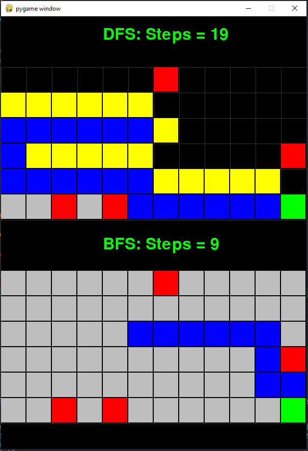

# Introduction

A simple comparative visualizer that compares how the paths are explored in BFS and DFS algorithms.
The application draws a tile using Pygame and traces the path to the bottom right (bottom right is the destination)



# Installation

To run the app you need Python 3.12.
Run `python -m pip install pipenv` to install pipenv
Run
```
pipenv install         # Install all the required packages
pipenv shell
python src/bfs_dfs.py  # To run the application`
```
# Legend

Orange color tile - Source
Red color tile - Obstacle
Yellow color tile - Location in Stack/Queue
Blue - Traced path
Grey - Visited tile

# Keys

l -> run the simulation
r -> reset the board
right arrow key -> Advance search by a step
